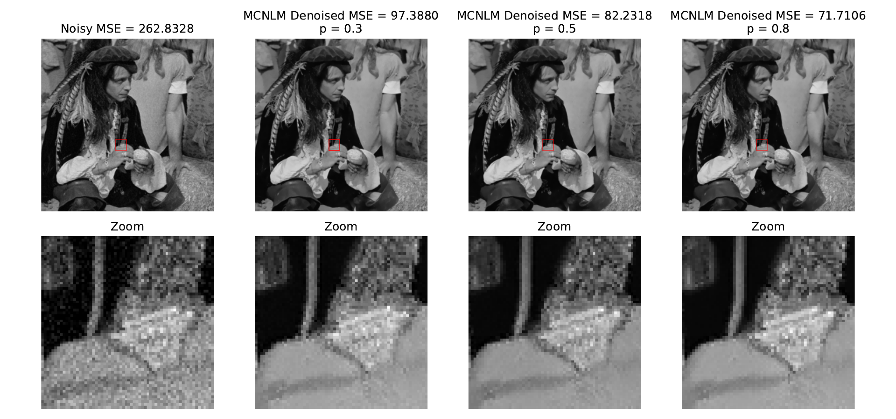
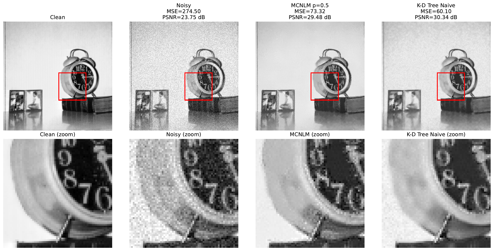
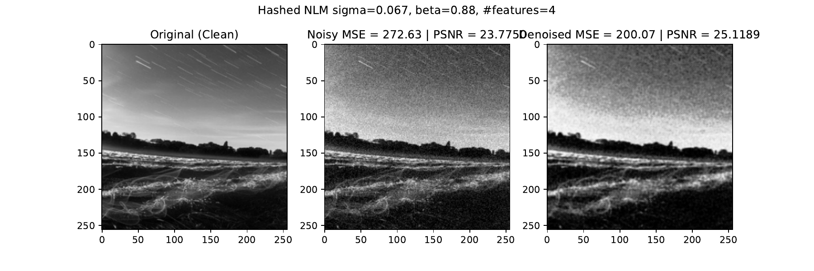
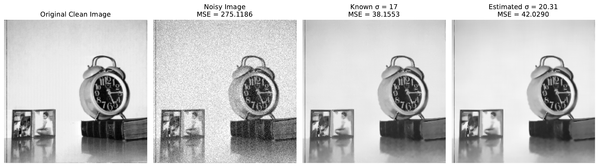

# Different Implementations of the Non-Local Means Denoising Algorithm

This repository contains the implementation of multiple NLM Denoising algorithms:
- baseline Non-Local Means (NLM)
- Monte Carlo NLM (MCNLM)
- semi-local (spatial) sampling
- KD-Tree accelerated NLM
- Hashed NLM
- FFT-based noise estimation

## Paper
The paper is available here: [nlm-denoising.pdf](./nlm-denoising.pdf)
- LaTeX source: `docs/main.tex` and `docs/sections/`
- Figures/plots: `docs/res/`

## Code and Implementation
- Python implementation lives in `mcnlm/src/mcnlm/`.
- CLI for reproducing plots: `mcnlm` (details in `mcnlm/README.md`).
- Key modules:
  - `mcnlm/src/mcnlm/mc_nlm.py` (Monte Carlo NLM)
  - `mcnlm/src/mcnlm/naive_nlm.py` (baseline NLM)
  - `mcnlm/src/mcnlm/kdtree.py` (KD-Tree NLM)
  - `mcnlm/src/mcnlm/hashnlm.py` (Hashed NLM)
  - `mcnlm/src/mcnlm/mc_convergence.py` (stochastic analysis + plots)

## Results (from the paper)

MCNLM denoising with different sampling probabilities:

Method comparison (Noisy vs MCNLM vs KD-Tree):

Hashed NLM comparison:

Noise estimation using FFT (known vs estimated sigma):

## Quick Start
See [`mcnlm/README.md`](./mcnlm/README.md) for setup and plot reproduction commands.
